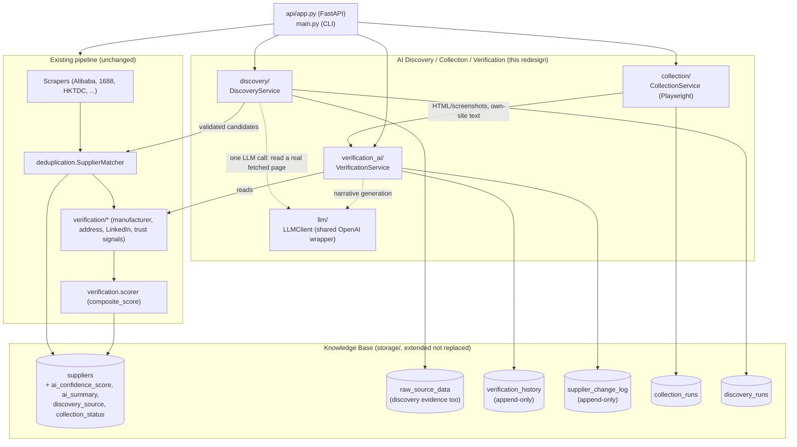
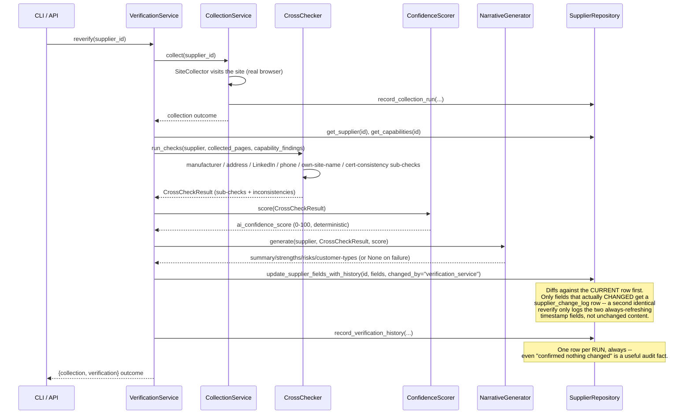
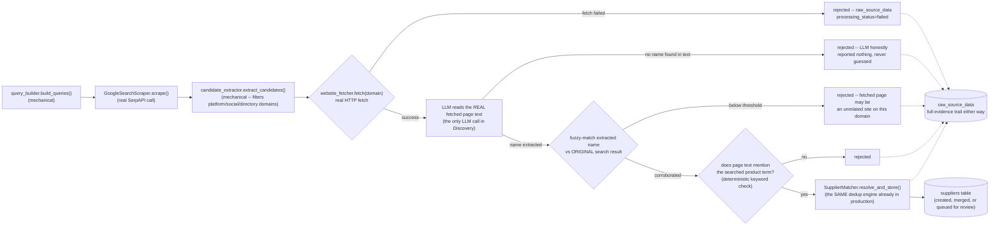

# Architecture: AI Discovery/Collection/Verification Platform

This document covers the four subsystems added on top of the existing scrape → dedup → verify → score pipeline (see `README.md` for that original architecture, which is unchanged). For the full rationale behind every design decision here, see the original plan at `.claude/plans/deep-wibbling-rivest.md`.

## Why this exists

The original pipeline discovers suppliers primarily by scraping B2B marketplace listings (Alibaba, 1688) and layering rule-based verification on top. That's real, useful data, but it has a ceiling: it can only find what a marketplace already lists, and its verification is limited to what a handful of independent, narrowly-scoped checks can confirm. This redesign adds:

- **Discovery** that searches the open web for candidate suppliers, not just marketplace listings.
- **Collection** that visits a supplier's own site with a real browser (JS-rendered pages, screenshots, downloads) instead of a plain HTTP fetch.
- **Verification** that synthesizes every existing signal plus new cross-reference checks into one AI-written assessment, not just a rule-based score.
- A **Knowledge Base** hardened with append-only history, so a supplier's record improves over time instead of being overwritten.

## Deployment model

All four subsystems run inside the **same single FastAPI app and SQLite database** as the existing pipeline — not four separately-deployed microservices. This was a deliberate scope decision: a real task queue and multi-service deployment is a bigger, separate infrastructure project than this redesign, and the current single-instance Railway deployment (see `DEPLOY.md`) doesn't need it yet. Each subsystem is still cleanly separated in code (own package, own interfaces, own database tables) specifically so it *could* be extracted into a real separate service later without a rewrite.



## Module layout

```
llm/                     Shared LLM wrapper -- everything else depends on it
  client.py              LLMClient: complete()/complete_json()/complete_vision(), retry+backoff
  exceptions.py

discovery/
  query_builder.py        product/category/country -> SerpAPI query variants (no LLM)
  candidate_extractor.py   search results -> unique candidate domains (no LLM, mechanical)
  candidate_validator.py   fetch real page -> LLM reads it (never invents) -> fuzzy-match corroboration
  discovery_service.py     orchestrator, DI'd like SupplierIntelligencePipeline

collection/
  proxy_provider.py        ProxyProvider ABC; WebshareProxyProvider + NoProxyProvider implemented;
                            BrightData/Oxylabs/Decodo/IPRoyal are documented stubs
  artifact_store.py        filesystem layout under COLLECTION_ARTIFACTS_DIR
  site_collector.py        sync Playwright, duck-type compatible with OwnWebsiteScraper's output
  collection_service.py    batch orchestrator: semaphore + wall-clock budget guards
  schemas.py

verification_ai/
  cross_checker.py         orchestrates EXISTING verification/* modules + new consistency checks
  confidence_scorer.py     deterministic 0-100 rollup (rule-based, NOT an LLM call)
  narrative_generator.py   LLM-backed summary/strengths/risks/customer-types, grounded-only prompt
  verification_service.py  verify() / verify_pending() / reverify()
```

"Knowledge Base" is not a new package — it's `storage/` extended, matching the existing two-layer (`raw_source_data` + `suppliers`) model from the original pipeline.

## Design principles that shaped every module

**Nothing existing is replaced.** `manufacturer_verifier.py`, `trust_signals.py`, `facility_address_verifier.py`, `linkedin_presence.py`, `scorer.py` all stay exactly as they were — `verification_ai/cross_checker.py` orchestrates them as sub-checks and adds an AI synthesis layer on top. `OwnWebsiteScraper` (cheap, no JS) stays the default for the existing `extract-capabilities` pipeline stage; `collection.SiteCollector` (Playwright, richer) is a duck-type-compatible alternative reachable through the same injectable seam, not a forced swap.

**Anti-hallucination is structural, not a prompt instruction.** Discovery Service's entire pipeline is built so the LLM can only ever *read* a real, already-fetched document — never generate a company from nothing. Every accepted supplier traces to: a real SerpAPI search hit → a real successfully-fetched website → that website's own text corroborating the identity. See the sequence diagram below.

**`ai_confidence_score` is deliberately never blended with `composite_score`.** Same precedent as `commercial_compatibility_score` elsewhere in this codebase. `composite_score` (existing) answers "how strong is this supplier's platform track record." `ai_confidence_score` (new) answers "how much do independent sources corroborate this supplier's claimed identity and capabilities." Different questions, both worth keeping visible.

**Sync Playwright, not async.** `api/jobs.py`'s background jobs already run on a worker thread via Starlette's `BackgroundTasks` (confirmed: `run_in_threadpool`), not the event loop. A `sync_playwright()` context confined to one such job call is Playwright's own supported usage pattern. The codebase is otherwise 100% synchronous outside FastAPI's own request lifecycle, so this is the lower-risk, convention-consistent choice — the isolation "async where appropriate" wants is already provided by `BackgroundTasks`' threadpool.

## The `reverify` flow

The concrete mechanism behind "update existing records when reverified, never overwrite" — this is the most novel workflow in the redesign, worth its own diagram:



## The Discovery anti-hallucination gate



## Extension points

`collection/proxy_provider.py` defines `BrightDataProxyProvider`, `OxylabsProxyProvider`, `DecodoProxyProvider`, `IPRoyalProxyProvider` as stubs against the same `ProxyProvider` interface `WebshareProxyProvider` implements. Each raises `NotImplementedError` with a pointer back to the interface if selected — a caller who mistakenly configures one fails loudly rather than silently collecting with no proxy. Implementing one is: subclass `ProxyProvider`, implement `is_configured()` and `get_proxy_config()` (returning Playwright's `{"server", "username", "password"}` launch-option shape), add it to `_PROVIDERS` in `select_proxy_provider()`.

## Schema (v11)

New `suppliers` columns: `ai_confidence_score`, `ai_confidence_assessed_at`, `ai_summary`, `ai_strengths`, `ai_risks`, `ai_suitable_customer_types`, `ai_verification_model`, `discovery_source`, `collection_last_run_at`, `collection_status`. New tables: `verification_history`, `supplier_change_log`, `collection_runs`, `discovery_runs`. `raw_source_data` is reused as-is for discovery evidence (`source='discovery'`). See `storage/database.py`'s `MIGRATIONS[11]` for the exact DDL and `storage/repository.py`'s new methods (`update_supplier_fields_with_history`, `get_suppliers_needing_collection`, `get_suppliers_needing_ai_verification`, `get_suppliers_needing_reverification`, and the `record_*`/`get_*` pairs for each new table).

## CLI + API surface

| CLI | API | Purpose |
|---|---|---|
| `discover PRODUCT [--category] [--country] [--limit]` | `POST /discovery/jobs` | AI-assisted discovery |
| `collect [--supplier-id \| --pending] [--limit] [--force]` | `POST /collection/jobs` | Visit a supplier's site with a real browser |
| `verify-ai [--supplier-id \| --pending] [--limit] [--force]` | `POST /verification/jobs` | AI cross-check + confidence score |
| `reverify [--supplier-id \| --older-than-days] [--limit]` | `POST /suppliers/{id}/reverify` | Re-collect then re-verify |
| `history --supplier-id ID` | `GET /suppliers/{id}/verification-history`, `GET /suppliers/{id}/change-log` | Audit trail |

Every job endpoint reuses the **existing** `pipeline_jobs` table and `GET /pipeline/jobs/{id}` polling pattern the original pipeline already established for `POST /pipeline/jobs` — no new job infrastructure was built for this redesign.

See `DEPLOY.md` for environment variables (`COLLECTION_ARTIFACTS_DIR`, `WEBSHARE_PROXY_*`, `RAILPACK_PYTHON_PLAYWRIGHT_INSTALL`) and the Railway-specific Playwright build gotcha.
